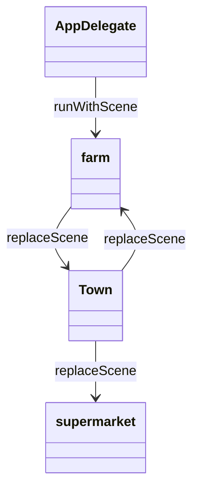
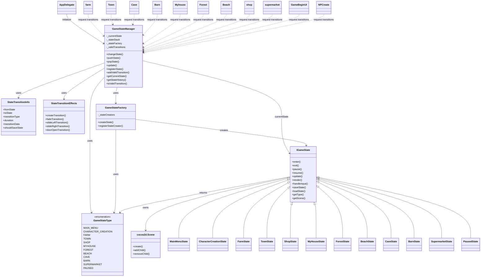

# 代码重构文档——游戏状态管理State模式方案

- 姓名：[李思远]
- 学号：[2351284]
- 重构模块：`GameStateManager` 及相关场景状态类

---

## 1. 原始代码存在的问题

### 1.1 问题描述

- **缺乏统一状态管理**：`AppDelegate`, 各 Scene（`farm`, `Town`, `supermarket` 等）直接调用 `Director::replaceScene`，没有抽象层，违反单一职责与开闭原则。
- **状态转换混乱**：场景切换逻辑散落在 UI 回调与场景类中，双向耦合严重，难以追踪与维护。
- **缺少状态定义与生命周期**：仅靠零散布尔变量（`frombed`, `IsNextDay`, `IsSleep`）描述状态，无法表达复杂流程，也无法暂停/恢复。
- **扩展困难**：新增场景需修改多处 `if/else` 或硬编码函数，存在大量重复代码。
- **调试困难**：无法查询当前状态、状态历史以及转换路径，不利于定位问题。

### 1.2 问题示例

```cpp
// AppDelegate.cpp
void AppDelegate::runScene(cocos2d::Director* director) {
    Initialize();
    // director->runWithScene(farm::create());
    director->runWithScene(BeginScene::create());
}

// farm.cpp
void farm::switchToTown() {
    auto townScene = Town::create();
    Director::getInstance()->replaceScene(townScene); // 无状态保存，无统一入口
}
```

---

## 2. 重构思路与设计模式分析

### 2.1 选用的设计模式

- **State Pattern（状态模式）**

### 2.2 设计模式简介

- **定义**：将对象的状态封装成独立类，并在状态改变时切换对象所关联的状态实例，使对象在行为上看似修改了自身类。
- **结构**：`Context`（状态管理器） + `State` 抽象接口 + 多个具体 `ConcreteState`。
- **应用场景**：对象行为依赖状态且状态数量较多，状态切换需解耦业务逻辑；需避免大量条件分支；需要状态生命周期管理。

### 2.3 选择该设计模式的理由

- 将“游戏状态”视作一等公民，隔离不同场景逻辑，减少耦合。
- 新增状态仅需实现 `IGameState` 并注册到管理器，符合开闭原则。
- 通过状态栈与转换信息，支持暂停、背包等叠加状态。
- 提供统一入口记录日志、触发过渡动画、保存/恢复数据。

### 2.4 重构设计思路

1. **抽象接口**：`IGameState` 定义 `enter/exit/pause/resume/update/render/handleInput`。
2. **上下文管理器**：`GameStateManager` 负责状态注册、切换、栈管理、历史记录、转换动画。
3. **具体状态类**：至少实现 `MainMenuState`, `CharacterCreationState`, `FarmState`, `TownState`, `ShopState`, `PausedState`，并支持扩展。
4. **状态转换信息**：`StateTransitionInfo` 描述 `from/to`、过渡类型、持续时间、参数、是否保存。
5. **场景解耦**：场景不再直接调 `Director::replaceScene`，统一调用 `GameStateManager`。
6. **配置/调试**：可选 JSON 状态配置、调试日志、历史打印接口。

---

## 3. 重构后的代码实现

### 3.1 核心代码变更对比

- **基础设施**：新增 `GameState.h` 定义 `GameStateType`、`StateTransitionInfo` 与 `IGameState`；`GameStateManager.{h,cpp}` 负责注册/切换/记录/暂停；`StateTransitionEffects.{h,cpp}` 提供 `fade/slide/flip/door_open` 等过渡效果；`ConcreteGameStates.{h,cpp}` 为主菜单、角色创建、农场、小镇、商店、家、森林、沙滩、洞穴、畜棚、暂停等状态提供统一的 `enter/exit` 行为。
- **入口**：`AppDelegate::applicationDidFinishLaunching` 中注册全部状态、声明合法转换、设置调度回调，并由 `GameStateManager::changeState(GameStateType::MAIN_MENU, "fade", 1.0f)` 启动游戏。
- **场景调用**：`GameBeginUI`, `CreateCharacterUI`, `farm`, `Town`, `supermarket`, `Myhouse`, `Forest`, `Beach`, `Cave`, `Barn` 等文件全部用 `GameStateManager::getInstance().changeState(...)` 替换 `Director::replaceScene`，并根据场景语义设置不同的转场效果与参数。

```cpp
// AppDelegate.cpp（节选）
stateManager.registerState<FarmState>(GameStateType::FARM);
stateManager.addValidTransition(GameStateType::FARM, GameStateType::TOWN);
stateManager.changeState(GameStateType::MAIN_MENU, "fade", 1.0f);

// farm.cpp（节选）
if (barn_area.containsPoint(playerPos) && isEnterKeyPressed) {
    GameStateManager::getInstance().changeState(GameStateType::BARN, "slide_right", 0.8f);
}

// GameBeginUI.cpp（节选）
void NextScene::menuNewCallback(Ref* sender) {
    GameStateManager::getInstance().changeState(GameStateType::CHARACTER_CREATION, "fade", 3.0f);
}
```

### 3.2 详细变更说明

变更文件与说明：

- `Classes/GameState.h`：定义状态枚举、转换信息结构及抽象接口。
- `Classes/GameStateManager.{h,cpp}`：实现单例状态管理器、状态工厂、合法转换表、状态栈与调度循环。
- `Classes/StateTransitionEffects.{h,cpp}`：封装 `TransitionScene` 与自定义开门/传送动画。
- `Classes/ConcreteGameStates.{h,cpp}`：为 BeginScene、CreateCharacter、Farm/Town/Shop/MyHouse/Beach/Forest/Cave/Barn及暂停覆盖层提供具体实现。
- `Classes/AppDelegate.cpp`：初始化状态机、注册转场、调度 `update`，并取消原来的 `director->runWithScene`。
- `Classes/GameBeginUI.cpp`, `CreateCharacterUI.cpp`：菜单、角色创建回调统一调用状态机。
- `Classes/farm.cpp`, `Town.cpp`, `supermarket.cpp`, `Myhouse.cpp`, `Forest.cpp`, `Beach.cpp`, `Cave.cpp`, `Barn.cpp`：所有入口/出口切换、日切逻辑改为通过状态机切换并保留原本的数据更新/音频控制。

核心差异示例：

```diff
- Director::getInstance()->replaceScene(Town::create());
+ GameStateManager::getInstance().changeState(GameStateType::TOWN, "slide_left", 0.8f);

- Director::getInstance()->replaceScene(TransitionFade::create(3.0f, nextday));
+ GameStateManager::getInstance().changeState(GameStateType::MYHOUSE, "fade", 3.0f);
```

### 3.3 主要文件更改详情

| 文件 | 关键修改 | 备注 |
| ---- | ---- | ---- |
| `Classes/AppDelegate.cpp` | 注册 11 个具体状态、配置合法转换、接入状态更新调度、以状态机启动游戏 | 删除所有直接 `runWithScene` 调用，统一改为 `GameStateManager` |
| `Classes/GameBeginUI.cpp` | 主菜单选项改为触发状态机切换至角色创建/退出 | 保留原有动画，仅替换回调逻辑 |
| `Classes/CreateCharacterUI.cpp` | 角色创建完成后改为进入 `MYHOUSE` 状态 | 新角色初始化仍在当前文件完成 |
| `Classes/farm.cpp` | 所有出口（家、Barn、Cave、Forest 等）与日终逻辑改用状态机，并设置不同的转场效果 | 继续维护全局变量与任务/作物逻辑 |
| `Classes/Town.cpp` | 进入商店/森林/沙滩、睡觉等流程全部改用状态机，附带音频切换 | `door_open`、`slide_left` 等效果展示 |
| `Classes/supermarket.cpp` | 退出商店返回小镇、睡觉流程统一改用状态机 | 保持原交互提示与音频控制 |
| `Classes/Myhouse.cpp` | 出门、睡觉、自动保存均通过状态机处理，含不同的 `fade` 时长 | 睡觉时仍显示原有睡觉贴图 |
| `Classes/Forest.cpp`, `Beach.cpp`, `Cave.cpp`, `Barn.cpp` | 各自与农场/小镇/家之间的切换统一调用 `GameStateManager`，并指定合适的动画方向 | 确保 `T_lastplace/F_lastplace/W_lastplace` 逻辑保持不变 |

除此之外，新引入的 `GameState` 相关文件形成完整的状态框架，为未来新增如 `INVENTORY`、`PAUSED` 栈式状态预留了接口。

---

## 4. UML类图说明

### 4.1 重构前类图（部分示例）



### 4.2 重构后类图



### 4.3 类图对比分析

- 重构前：场景互相依赖，关系网状。
- 重构后：所有状态通过 `GameStateManager` 交互，形成星型拓扑，职责清晰，便于扩展与测试。

---

## 5. 重构解决的问题和收益

### 5.1 解决的具体问题

- **状态混乱** → `GameStateManager` 统一调度，提供状态定义、生命周期管理。
- **耦合过高** → 场景不再互相引用，只关心自身状态逻辑。
- **无法保存/恢复** → 状态接口提供 `saveState/loadState`，支持暂停与回滚。
- **扩展困难** → 新状态仅需实现接口并注册，不影响其他模块。
- **调试困难** → 状态历史与调试日志便于追踪。

### 5.2 获得的收益

- **可读性**：`AppDelegate` 仅负责注册状态与调度；各场景文件保留自身业务并通过 `GameStateManager` 切换，逻辑层次分明。
- **可维护性**：新增状态只需实现 `IGameState` 并注册，无需触碰其他场景文件，显著降低联动修改成本。
- **可扩展性**：状态工厂、合法转换表与 `StateTransitionInfo` 支持参数化动画、自动保存、回退等需求。
- **设计原则**：实现了 SRP/OCP/LSP；暂停层、背包等叠加状态可通过 `pushState/popState` 完成，行为替换清晰。
- **性能/体验**：统一的过渡效果与资源创建时机减少了重复加载，开门/滑动等动画提升用户体验。

---

## 6. 重构过程反思与总结

### 6.1 重构过程中的挑战

- **挑战1**：梳理全部场景切换路径，保证覆盖 → 解决：先绘制状态图并列出切换表。
- **挑战2**：与现有输入/事件系统整合 → 解决：状态实现 `handleInput`，统一委派。

### 6.2 经验教训

- 状态划分需适度，建议先涵盖场景级别，再评估 UI/系统级状态（如背包、技能树）是否需要单独抽象。
- 在 Cocos2d-x 中切换场景时须小心全局指针与资源释放，状态 `enter/exit` 做好 `retain/release` 管理非常重要。
- 统一输入/暂停逻辑时要考虑已有的 `EventDispatcher`，必要时在状态中转发或屏蔽事件，避免重复响应。

### 6.3 对未来开发的启示

- 任何具备“流程/阶段”的系统都应优先评估状态模式或状态机方案。
- 提前设计状态转换表，减少后期重构成本。

---

## 7. AI工具使用情况

### 7.1 使用的AI工具

- ChatGPT / Cursor AI 助手（规划与实现阶段）

### 7.2 AI工具的具体应用

- **代码分析**：帮助定位各场景的 `replaceScene` 调用、梳理转换链路与全局变量依赖。
- **设计阶段**：生成 `GameStateManager`、`IGameState`、具体状态类、转场效果等骨架并讨论转换策略。
- **编码实现**：协助批量替换场景切换代码、保持语法正确，提供示例片段以加速落地。

### 7.3 AI工具使用的最佳实践

- 问题描述越具体，得到的设计建议越贴近需求。
- 对 AI 输出保持审慎，结合项目上下文验证。

### 7.4 AI工具的局限性和挑战

- 难以完全理解项目特有的资源/内存管理约束，需要人工校验。
- 生成代码可能未考虑所有边界条件，需手动测试。

### 7.5 对AI辅助编程的反思

- AI 在大规模重构中可承担“规划 + 代码模板”角色，但实际接入仍需开发者验证与调试。
- 与 AI 迭代交流需求/上下文可以快速形成可执行方案和文档草稿，提升团队沟通效率。

---

## 附录

### A. 相关文件清单

- `Classes/GameState.h`
- `Classes/GameStateManager.{h,cpp}`
- `Classes/ConcreteGameStates.{h,cpp}`
- `Classes/StateTransitionEffects.{h,cpp}`
- `Classes/AppDelegate.cpp`
- 关键场景类（`farm`, `Town`, `supermarket`, `GameBeginUI`, `CreateCharacterUI`, `Myhouse`, `Beach`, `Forest`, `Cave` 等）

### B. 参考资料

- 《Game Programming Patterns》State章节
- Cocos2d-x 官方文档（场景与Director）
- 项目 `state pattern.txt` 提供的需求与示例

---
